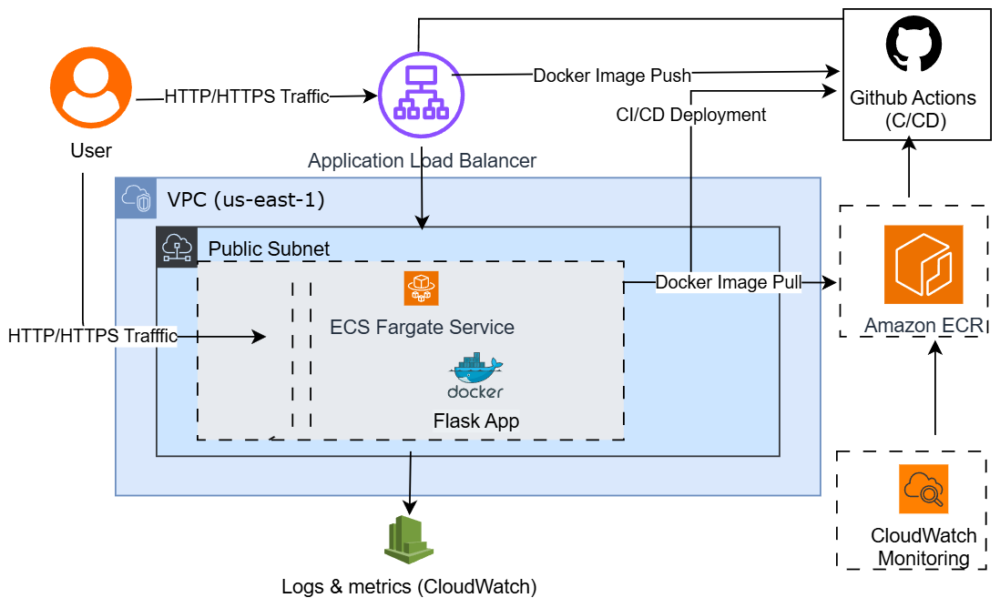

# 🚀 Mertmart Cloud Platform – Flask App on AWS ECS Fargate



---

## 🧠 Overview

This project is a **production-style cloud application** built for **Mertmart Group**, showcasing real-world implementation of:

* Cloud Infrastructure (AWS)
* DevOps & CI/CD Automation
* Containerized Deployments
* Cloud Security Best Practices

💡 Unlike typical demo projects, this system is designed to **support actual business workflows**, making it a practical example of cloud engineering in action.

---

## 🏗️ Architecture Diagram


### 🔹 Architecture Flow

1. User request hits **Application Load Balancer (ALB)**
2. Traffic routed to **ECS Fargate service**
3. Containers pull images from **Amazon ECR**
4. Logs and metrics sent to **CloudWatch**
5. CI/CD pipeline updates application automatically

---

## ⚙️ Core Features

* 🚀 Containerized Flask application (Docker)
* ☁️ Serverless compute using ECS Fargate
* 🔁 Automated CI/CD with GitHub Actions
* ⚖️ Load-balanced architecture for scalability
* 🔐 IAM-based security and access control
* 📊 Monitoring and logging with CloudWatch

---

## 🧩 Real-World Business Impact (Mertmart)

This system is part of **Mertmart Group’s cloud platform**, enabling:

* Internal business operations support
* Foundation for inventory and order management
* Scalable infrastructure for future growth

💥 Demonstrates how small businesses can adopt **enterprise-grade cloud solutions**

---

## 🔁 CI/CD Pipeline

```yaml id="m6t2wr"
name: Deploy to AWS ECS

on:
  push:
    branches: [ main ]

jobs:
  deploy:
    runs-on: ubuntu-latest
```

### Pipeline Flow:

* Push code → GitHub
* Build Docker image
* Push to Amazon ECR
* Deploy to ECS Fargate

---

## 🚀 Deployment Steps

```bash id="65myrg"
# Build Docker image
docker build -t mertmart-app .

# Tag image
docker tag mertmart-app:latest <ECR-REPO-URI>

# Push to ECR
docker push <ECR-REPO-URI>
```

---

## 🔐 Security Implementation

* IAM roles with **least privilege access**
* Secure container registry (ECR)
* Network isolation via VPC & Security Groups
* Environment variable management for secrets
* Centralized logging (CloudWatch)

---

## 💻 Run Locally

```bash id="2m0z11"
# Install dependencies
pip install -r requirements.txt

# Run app
python app.py
```

Then open:
👉 [http://localhost:5000](http://localhost:5000)

---

## 📂 Project Structure

```id="mjla00"
├── app.py
├── Dockerfile
├── requirements.txt
```

---

## 📸 Screenshots


💡 Replace these with your actual screenshots:

* ECS running service
* CloudWatch logs
* ALB DNS working
* App in browser

---

## 🛠️ Tech Stack

* Python (Flask)
* Docker
* AWS ECS Fargate
* Amazon ECR
* GitHub Actions
* AWS CloudWatch
* Terraform (Infrastructure provisioning)

---

## 📊 Skills Demonstrated

* Cloud Architecture (AWS)
* Infrastructure as Code (Terraform)
* DevOps & CI/CD
* Containerization
* Cloud Security
* Monitoring & Observability

---

## 📈 Future Enhancements

* 🔹 Database integration (RDS / DynamoDB)
* 🔹 Authentication system (JWT / AWS Cognito)
* 🔹 Auto-scaling policies
* 🔹 Advanced monitoring dashboards
* 🔹 Basic anomaly/fraud detection

---

## 👤 Author

**Richard Kweku Addae**
Cloud & DevOps Engineer | AWS Certified Solutions Architect

🔗 [https://linkedin.com/in/richard-addae](https://linkedin.com/in/richard-addae)
🔗 [https://github.com/codrich](https://github.com/codrich)

---
